# Querio Architecture

> **A type-safe, declarative query language for TypeScript APIs.**

Querio must feel like a high-quality TypeScript developer library: small public API, excellent type inference, composable primitives, predictable behavior, strong errors, clear architecture, and easy extensibility.

The architecture below is **mandatory**. Do not introduce abstractions, dependencies, or shortcuts that violate these boundaries.

---

## 1. Processing Pipeline

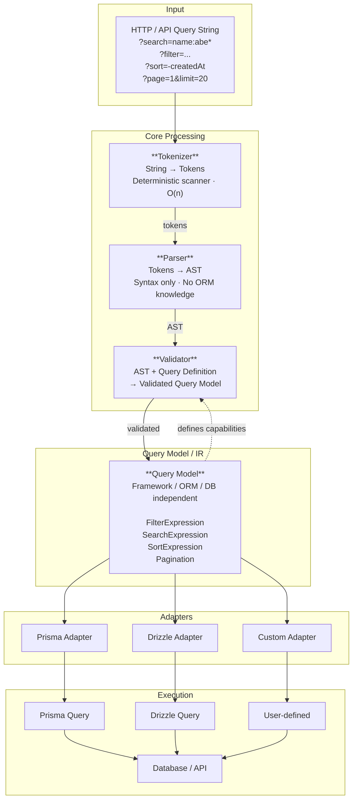

The architectural stages:

```
Declaration → Tokenization → Parsing → Validation → Query Model → Compilation → Execution
```

This separation is mandatory.

---

## 2. Dependency Direction

Dependencies must point toward the framework-independent core.

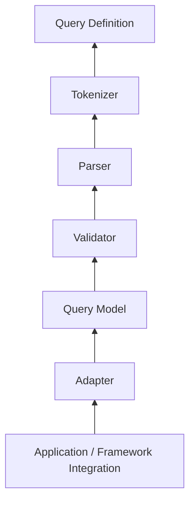

The core must **never depend on infrastructure**.

Forbidden dependencies:

```
❌ Querio Core → Prisma
❌ Querio Core → Drizzle
❌ Querio Core → NestJS
❌ Querio Core → Express
❌ Querio Core → Fastify
❌ Tokenizer → Database
❌ Parser → ORM
❌ Validator → Prisma
❌ Query Definition → Database
❌ Query Model → SQL
```

The core must not know that Prisma, Drizzle, SQL, PostgreSQL, NestJS, or any other framework exists.

---

## 3. Query Definition

Querio uses a schema-first fluent API inspired by the ergonomics of libraries such as Zod.

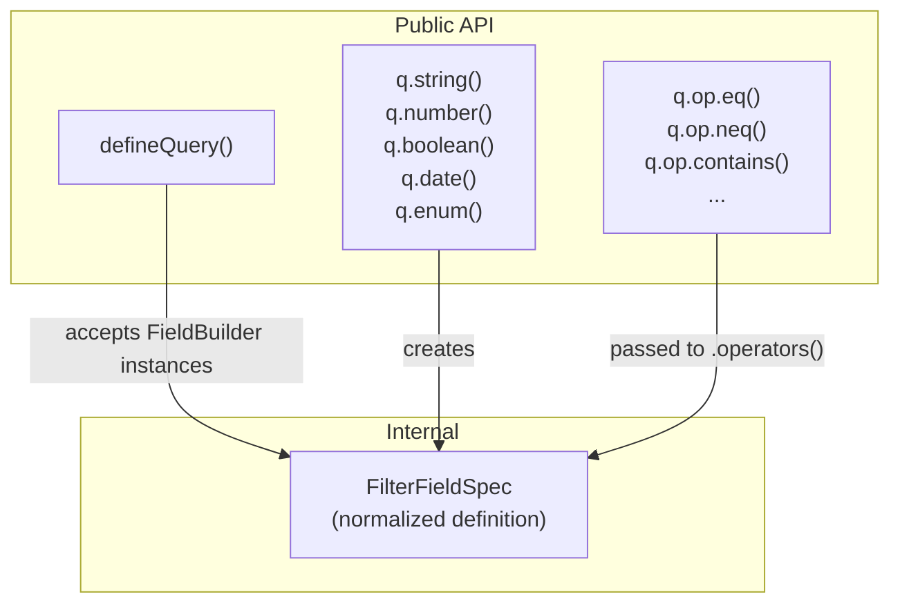

```ts
import { defineQuery, q } from 'querio';

const groupQuery = defineQuery({
  fields: {
    name: q
      .string()
      .max(100)
      .searchable()
      .sortable()
      .operators(
        q.op
          .eq()
          .neq()
          .contains()
          .startsWith()
          .endsWith()
          .in()
          .nin(),
      ),

    isSystem: q
      .boolean()
      .sortable()
      .operators(
        q.op
          .eq()
          .neq(),
      ),

    createdAt: q
      .date()
      .sortable()
      .operators(
        q.op
          .eq()
          .neq()
          .gt()
          .gte()
          .lt()
          .lte(),
      ),
  },
});
```

The query definition describes:

> **What** this resource allows clients to query.

It must not describe:

> **How** the database executes the query.

---

## 4. Field Builder Responsibilities

A field builder has three distinct responsibilities:

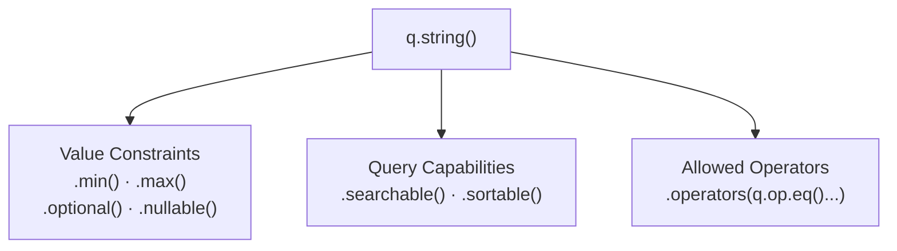

### Value type

```
q.string()   q.number()   q.boolean()   q.date()   q.datetime()   q.enum(...)
```

### Value constraints

```
.min()  .max()  .optional()  .nullable()
```

### Query capabilities

```
.searchable()  .sortable()
```

### Operators

```
.operators(q.op.eq().neq().contains())
```

Keep these concepts separate. Do not collapse them into a single generic configuration object.

---

## 5. Operator Architecture

Operators belong under the `q.op` namespace.

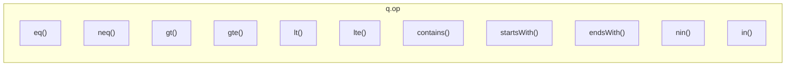

Operators are capabilities **explicitly granted** to fields.

```ts
q.boolean()
  .operators(
    q.op.eq(),
  );
```

The following must **not** be accepted at runtime:

```
isSystem:contains    ← "contains" is not a boolean operator
```

Operator availability should be represented in TypeScript wherever practical so that invalid combinations are rejected at compile time.

Runtime validation must still protect queries originating from HTTP or other untrusted sources.

---

## 6. Tokenizer

The tokenizer is responsible **only** for lexical analysis.

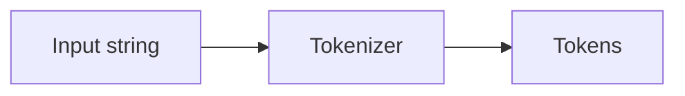

For `name:abe*`, the tokenizer produces conceptually:

```
IDENTIFIER("name")  →  COLON  →  VALUE("abe")  →  WILDCARD("*")
```

The tokenizer **must**:

- Use a deterministic scanner / state machine
- Operate in O(n) for normal input
- Avoid unnecessary regex-heavy parsing
- Track source positions (start, end)
- Produce useful syntax errors
- Handle quoted values correctly
- Support escaping where defined
- Remain independent from query schemas
- Remain independent from ORMs / databases
- Never execute queries
- Never validate whether a field exists

> The tokenizer understands **characters and lexical structure**, not query meaning.

The tokenizer must **not** know about:

```
Prisma · fields · database types · sortable fields · searchable fields · operators
```

---

## 7. Parser

The parser converts tokens into an Abstract Syntax Tree.

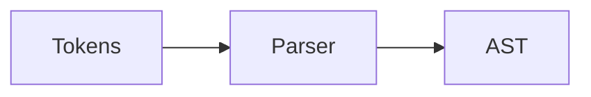

For `name:abe*`, the parser produces:

```
FieldExpression
├── field: "name"
├── wildcard: true
└── value: "abe"
```

The exact AST design may evolve, but the architectural rule does not:

> The parser understands **syntax**, not application capabilities.

The parser must **not** determine whether `name` actually exists. That belongs to validation.

---

## 8. Validation

Validation transforms parsed syntax into a valid Querio query model.

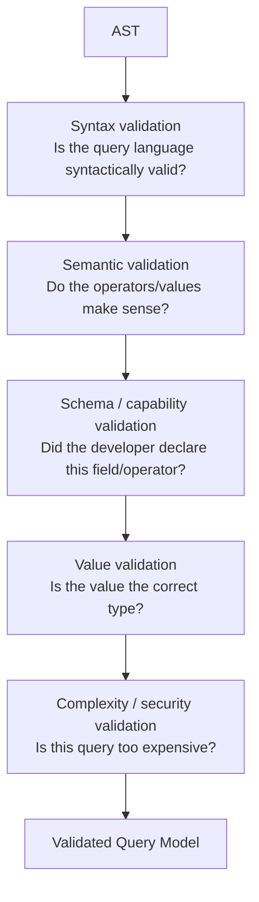

Validation stages:

```
Syntax validation        → Is the query language syntactically valid?
Semantic validation      → Are the operators meaningful?
Schema/capability validation → Did the developer declare this?
Value validation         → Is the value correct for the field type?
Complexity/security validation → Is this query within limits?
```

Examples:

```
Does the field exist?
Is the field searchable?
Is the field sortable?
Is this operator allowed?
Does the value have the correct type?
Is the value within configured limits?
Is this query too expensive?
```

---

## 9. Query Model / Intermediate Representation

After parsing and validation, Querio produces a framework-independent query model.

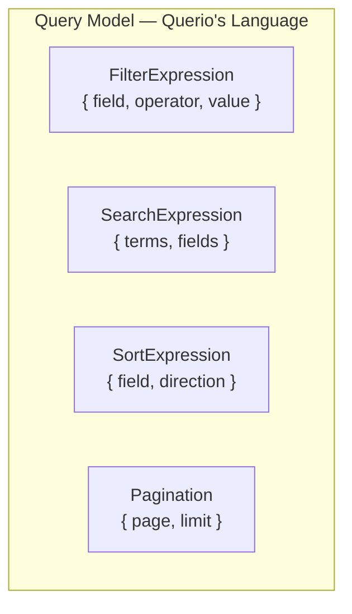

Example:

```ts
{
  filters: [
    { field: 'name', operator: 'startsWith', value: 'abe' },
  ],
  search: undefined,
  sort: [
    { field: 'createdAt', direction: 'desc' },
  ],
  pagination: {
    page: 1,
    limit: 20,
  },
}
```

This model **is Querio's language**.

It must **not** contain:

```
PrismaWhereInput · PrismaOrderBy · SQL fragments
Drizzle expressions · database-specific operators · ORM-specific types
```

The Query Model is the boundary between **Query Language** and **Query Execution**.

---

## 10. Search Architecture

Search is a first-class subsystem.

Supported concepts:

```
Global search          ?search=abebe
Field-specific search  ?search=name:abebe
Contains               ?search=abebe
Prefix                 ?search=name:abe*
Phrase                 ?search="abebe beke"
```

The processing pipeline:

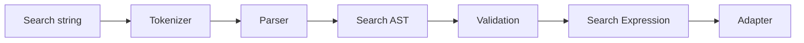

Global search operates **only** over fields explicitly marked `.searchable()`.

Field-specific search must verify that the requested field supports search.

Database-specific case-insensitive behavior (e.g. PostgreSQL `ILIKE`) belongs to the adapter and must **never** leak into Querio Core.

---

## 11. Sorting Architecture

Sorting must become explicit query data.

```
?sort=-createdAt,name
```

becomes:

```ts
[
  { field: 'createdAt', direction: 'desc' },
  { field: 'name', direction: 'asc' },
]
```

Validation:

```
Field exists?       → yes → Field is sortable?  → yes → ✅ Valid
                                         → no  → ❌ Validation error
                    → no  → ❌ Validation error
```

---

## 12. Pagination Architecture

Pagination is framework-independent.

```ts
{ page: 1, limit: 20 }
```

Future strategies:

```
Offset pagination · Page pagination · Cursor pagination
```

The core query model must not depend on how an adapter implements pagination.

---

## 13. Relations

Relations use the same declarative architecture.

```
Group
├── name
├── createdAt
└── permissions
      ├── codename
      ├── model
      └── appLabel
```

A relation contains another query definition.

Relation traversal must be explicitly declared. Do not permit arbitrary unrestricted paths (`a.b.c.d.e.f`) without capability and complexity controls.

Relations must be designed with:

```
Explicit declaration · Validation · Depth limits
Complexity limits    · Adapter translation
```

---

## 14. Adapters

Adapters translate the validated Querio Query Model into an execution-specific representation.

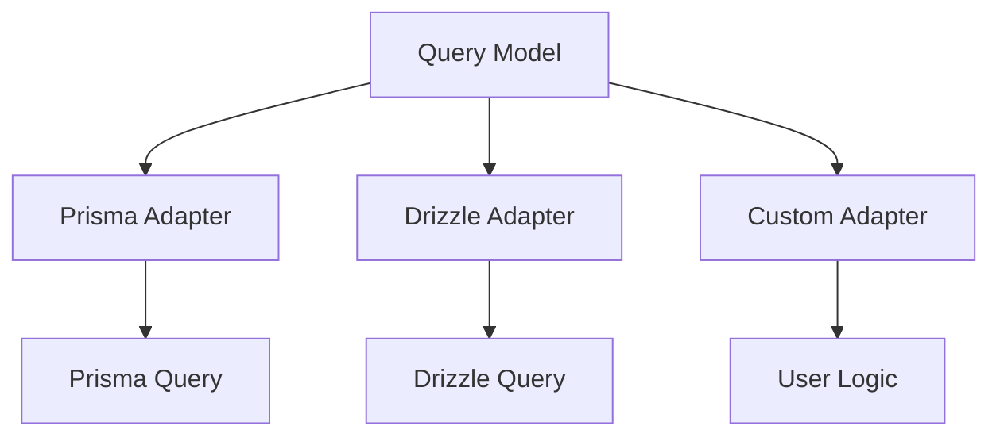

Potential packages:

```
@querio/prisma    @querio/drizzle
```

The adapter **owns**:

```
ORM translation            · Database-specific semantics
Database-specific limits   · Execution representation
Database-specific optimizations
```

The adapter must **not** modify Querio's semantic meaning.

---

## 15. NestJS Integration

NestJS integration must be isolated in `@querio/nestjs`.

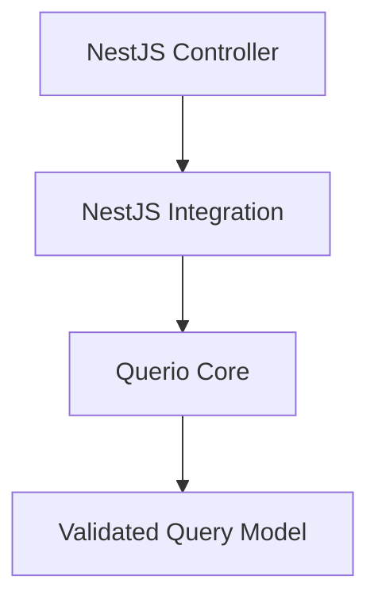

NestJS-specific concerns belong **only** in this integration package. The core must not import NestJS.

---

## 16. Package Structure

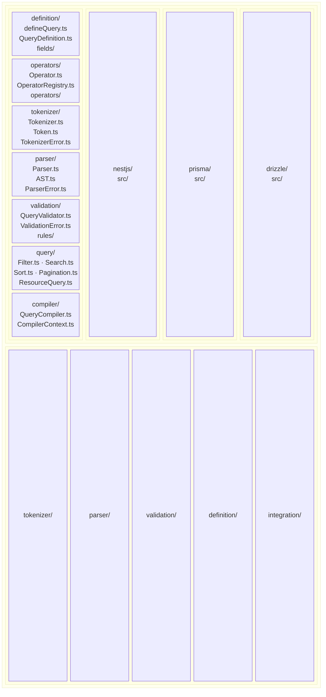

The exact filenames may evolve, but the architectural boundaries must remain.

---

## 17. Mandatory Directory Structure

The following directory structure is **mandatory**. Agents must not create files or directories outside this structure.

```
querio/
│
├── packages/
│   │
│   ├── core/
│   │   └── src/
│   │       │
│   │       ├── definition/
│   │       │   ├── defineQuery.ts
│   │       │   ├── query-definition.ts
│   │       │   ├── fields.ts
│   │       │   └── index.ts
│   │       │
│   │       ├── operators/
│   │       │   ├── operators.ts
│   │       │   ├── operator-types.ts
│   │       │   └── index.ts
│   │       │
│   │       ├── tokenizer/
│   │       │   ├── tokenizer.ts
│   │       │   ├── token.ts
│   │       │   ├── token-type.ts
│   │       │   ├── tokenizer-error.ts
│   │       │   └── index.ts
│   │       │
│   │       ├── parser/
│   │       │   ├── parser.ts
│   │       │   ├── ast.ts
│   │       │   ├── ast-types.ts
│   │       │   ├── parser-error.ts
│   │       │   └── index.ts
│   │       │
│   │       ├── validation/
│   │       │   ├── validator.ts
│   │       │   ├── validation-error.ts
│   │       │   ├── validation-types.ts
│   │       │   └── index.ts
│   │       │
│   │       ├── query/
│   │       │   ├── filter.ts
│   │       │   ├── search.ts
│   │       │   ├── sort.ts
│   │       │   ├── pagination.ts
│   │       │   ├── relation.ts
│   │       │   ├── query-types.ts
│   │       │   └── index.ts
│   │       │
│   │       ├── compiler/
│   │       │   ├── compiler.ts
│   │       │   ├── compiler-types.ts
│   │       │   └── index.ts
│   │       │
│   │       └── index.ts
│   │
│   ├── nestjs/
│   │   └── src/
│   │       ├── querio.pipe.ts
│   │       ├── querio.decorator.ts
│   │       └── index.ts
│   │
│   ├── prisma/
│   │   └── src/
│   │       ├── adapter.ts
│   │       ├── translators.ts
│   │       └── index.ts
│   │
│   └── drizzle/
│       └── src/
│           ├── adapter.ts
│           ├── translators.ts
│           └── index.ts
│
├── tests/
│   ├── definition/
│   ├── operators/
│   ├── tokenizer/
│   ├── parser/
│   ├── validation/
│   ├── query/
│   ├── compiler/
│   └── integration/
│
├── docs/
├── package.json
├── tsconfig.json
└── README.md
```

### Enforcement Rules

1. **Core modules must stay in `packages/core/src/`**: Do not create new top-level directories under `packages/core/src/` without explicit approval.

2. **One module per directory**: Each architectural module (definition, operators, tokenizer, parser, validation, query, compiler) has its own directory with an `index.ts` barrel export.

3. **Adapter packages are isolated**: `packages/prisma/`, `packages/drizzle/`, `packages/nestjs/` are separate packages that depend on core, never the reverse.

4. **Tests mirror source structure**: Test files go in `tests/<module>/` matching the source module name.

5. **No new directories without justification**: Before creating a new directory, verify it does not already exist and that it fits the established architecture.

6. **File naming conventions**:
   - Use kebab-case for filenames (e.g., `query-definition.ts`, `operator-types.ts`)
   - Each directory ends with `index.ts` as the public barrel export
   - Error types live in `<module>-error.ts` within their module directory

7. **New adapters go in `packages/<adapter-name>/`**: Follow the same structure as `prisma/` or `drizzle/`.

8. **New integrations go in `packages/<integration-name>/`**: Follow the same structure as `nestjs/`.

---

## 18. Core Design Principles

### Principle 1 — Core independence

```
Core knows query language.  Core does not know execution technology.
```

### Principle 2 — Single responsibility

```
Tokenizer → lexical structure
Parser    → syntax
Validator → correctness / capabilities
Model     → semantic representation
Adapter   → execution translation
```

### Principle 3 — Parse once

Do not repeatedly parse the same query at different layers.

```
Raw Query → Tokenize → Parse → Validate → Query Model
```

### Principle 4 — Validate once

Once a query model is validated, downstream adapters trust its semantic correctness.

### Principle 5 — Compile anywhere

The same Query Model is usable by Prisma, Drizzle, SQL, Mongo, HTTP APIs, and custom data sources.

### Principle 6 — Capabilities are explicit

Fields explicitly declare `searchable`, `sortable`, allowed operators, and value constraints. Never infer dangerous capabilities from the underlying ORM schema.

### Principle 7 — Security by declaration

Clients may only query capabilities explicitly exposed by the query definition.

### Principle 8 — Type safety

Prefer compile-time safety for field builders, operator builders, field types, operator compatibility, query definitions, and adapter contracts.

Runtime validation remains mandatory for untrusted input.

### Principle 9 — Framework independence

Querio Core is usable without NestJS, Prisma, Express, or Fastify.

### Principle 10 — Extensibility

Developers extend Querio without modifying its core. Extension points: custom field types, custom operators, custom validators, custom query capabilities, custom parsers, custom adapters.

Extensions use explicit contracts rather than internal implementation details.

---

## 19. Performance Requirements

The tokenizer and parser are performance-sensitive components.

Prefer:

```
Single-pass scanning · O(n) tokenization
Minimal allocations  · Deterministic parsing
```

Benchmark:

```
Small query  · Medium query  · Large query
Many filters · Many search terms
Nested relations · Invalid queries · Deep queries
```

Correctness comes first. Avoid premature optimization, but keep the architecture suitable for benchmarking.

---

## 20. Security and Complexity

Querio is an API query language and must assume that query input is untrusted.

Configurable limits:

```
Maximum query length      · Maximum number of filters
Maximum search terms      · Maximum term length
Maximum relation depth    · Maximum sort fields
Maximum pagination limit  · Maximum query complexity
```

Reject pathological queries before they reach the database. Do not allow clients to bypass declared capabilities.

---

## 21. Error Architecture

Errors are structured and developer-friendly.

Distinct error types:

```
TokenizerError      · ParserError       · ValidationError
CapabilityError     · QueryLimitError
```

Errors contain source information:

```
message · code · position · input context · field · operator
```

Example:

```
Invalid operator "contains" for field "isSystem".
The field supports: eq, neq.
```

Avoid leaking ORM / database implementation details through core errors.

---

## 22. Testing Architecture

Every major architectural layer is independently testable.

```
Tokenizer tests        · Parser tests       · Definition tests
Operator tests         · Validation tests    · Search tests
Sort tests             · Pagination tests    · Relation tests
Adapter tests          · Integration tests
```

Parser / tokenizer tests include malformed and edge-case inputs.

Consider property-based / fuzz testing for tokenizer, parser, and query validation — especially for untrusted HTTP input.

---

## 23. Public API Philosophy

The public API remains small. The developer primarily interacts with:

```ts
defineQuery(...)
q.string()   q.number()   q.boolean()   q.date()   q.enum(...)
q.op.eq()    q.op.neq()   q.op.contains()   ...
```

Do not expose internal parser / tokenizer / AST implementation details as the normal developer workflow.

Internal architecture may be sophisticated while the public API remains simple.

> **Simple outside, sophisticated inside.**

---

## 24. Architectural Mental Model

Always reason about Querio using these three boundaries:

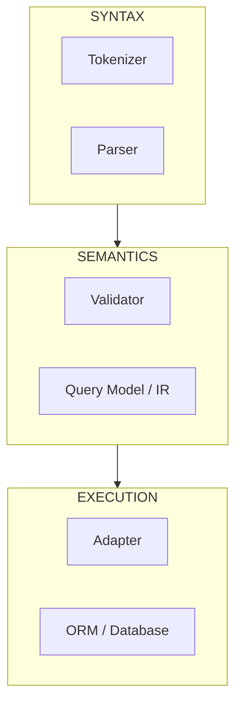

The most important separation:

```
Syntax  ≠  Semantics  ≠  Execution
```

Never collapse them.

---

## 25. Non-Negotiable Architecture

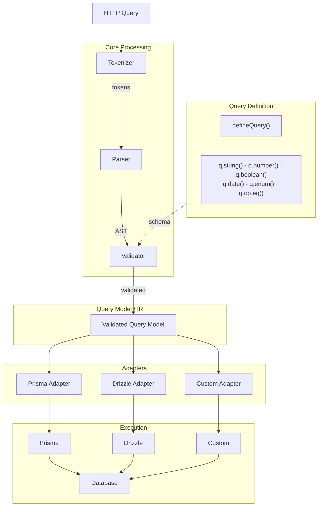

**The architectural law of Querio:**

> **Define once. Parse efficiently. Validate consistently. Represent semantically. Compile anywhere.**

Any future feature must fit into this architecture rather than bypassing it.
