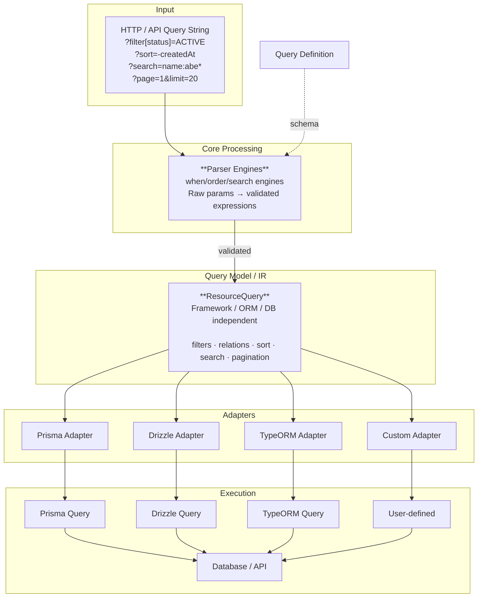
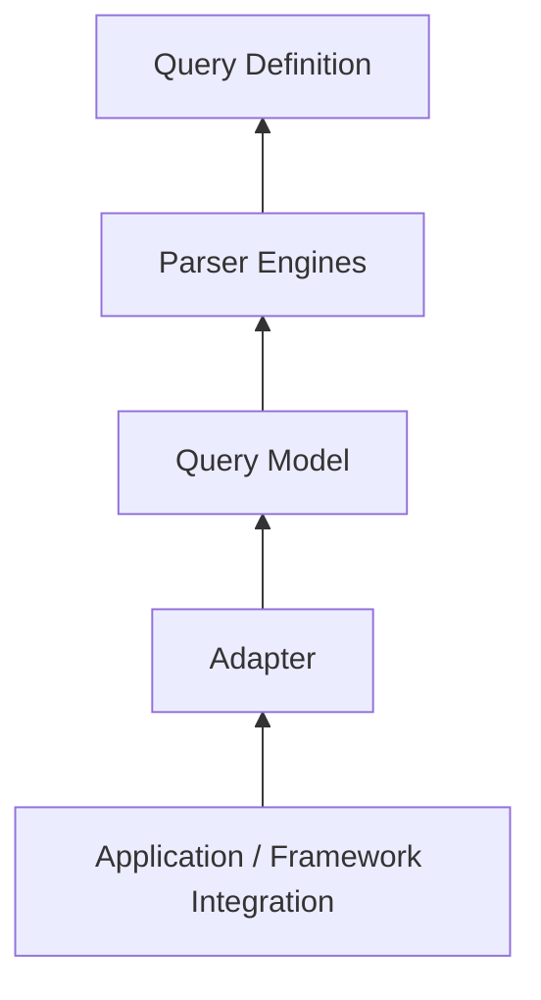
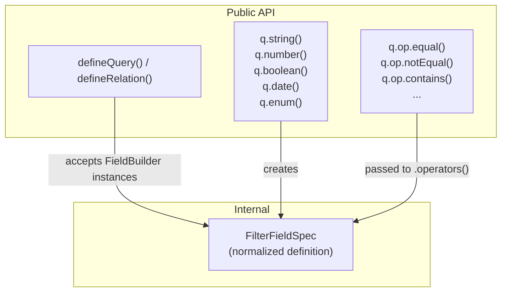
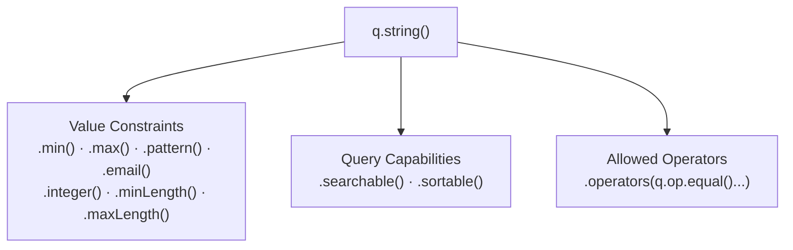
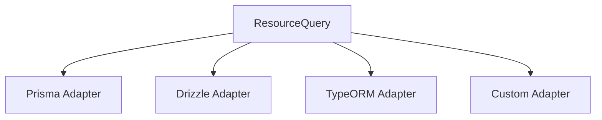
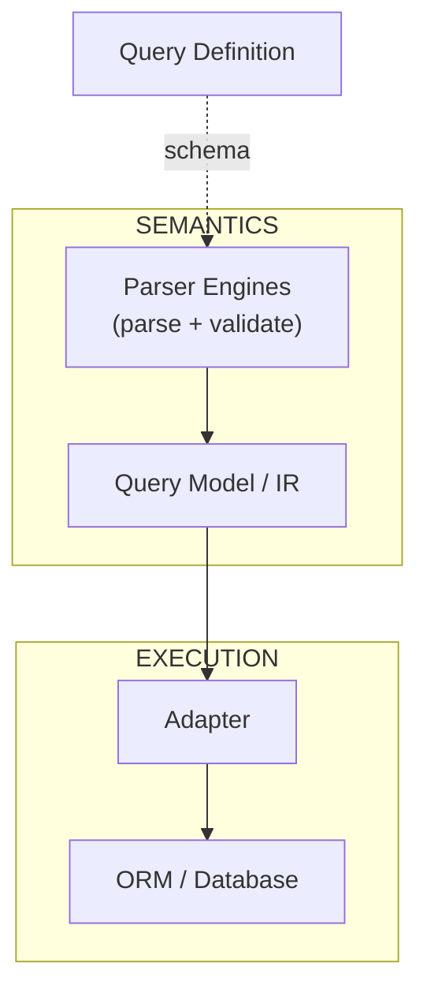
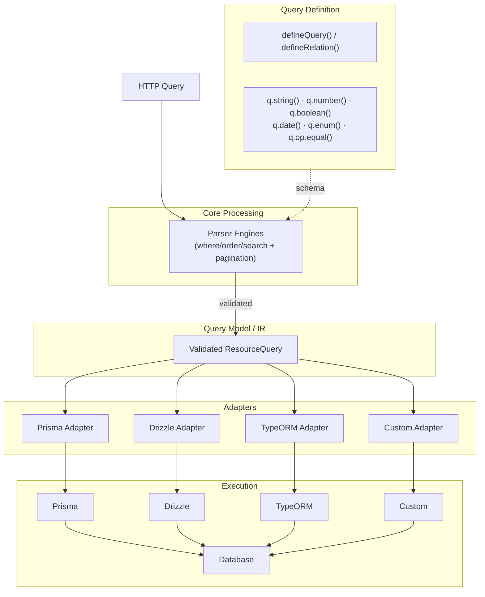

# QueryJS Architecture

> **A type-safe, declarative query language for TypeScript APIs.**

QueryJS is designed to feel like a high-quality TypeScript developer library: small public API, predictable behavior, strong errors, clear architecture, and easy extensibility. This document is the **source of truth** for how the shipped code is structured. Do not introduce abstractions, dependencies, or shortcuts that violate these boundaries.

---

## 1. Processing Pipeline

QueryJS parses raw HTTP query parameters into a validated, framework-independent query model (`ResourceQuery`), then compiles it to an ORM-specific representation via adapters.



The stages:

```
Query Definition → Parse & Validate (engines) → Query Model → Compilation (adapters) → Execution
```

- **Query Definition** declares *what* clients may query.
- **Parser engines** validate raw input against that definition and produce application-level expressions. No ORM knowledge anywhere in this stage.
- **Query Model** is the framework-independent intermediate representation.
- **Adapters** translate the model into an ORM's execution format.

---

## 2. Dependency Direction

Dependencies point **toward** the framework-independent core.



The core must **never** depend on infrastructure. Forbidden dependencies:

```
❌ QueryJS Core → Prisma
❌ QueryJS Core → Drizzle
❌ QueryJS Core → TypeORM
❌ QueryJS Core → Express / Fastify / any HTTP framework
❌ Query Definition → Database
❌ Query Model → SQL / ORM types
```

The core must not know that Prisma, Drizzle, TypeORM, SQL, PostgreSQL, or any HTTP framework exists. Adaptations (LIKE syntax, ILIKE, collations, `mode: insensitive`, join aliasing) belong exclusively to adapters.

---

## 3. Query Definition

The schema-first fluent `q` API declares a resource's queryable surface.



```ts
import { defineQuery, defineRelation, q } from '@queryjs/core';

const memberQuery = defineRelation({
  fields: {
    accountNo: q.string().sortable().searchable(),
  },
});

const usersQuery = defineQuery({
  fields: {
    status: q.enum(['ACTIVE', 'INACTIVE']).sortable().searchable(),
    firstName: q.string().sortable().searchable().operators(q.op.equal().contains()),
    email: q.string().sortable(),
    age: q.number().sortable(),
    createdAt: q.date().sortable(),
  },
  relations: {
    member: memberQuery,
  },
  limits: {
    maxLimit: 50,
    maxFilters: 100,
    maxNestingDepth: 2,
  },
});

const query = usersQuery.parse(req.query);
```

The query definition describes:

> **What** this resource allows clients to query.

It must not describe:

> **How** the database executes the query.

Definitions are **frozen** at `defineQuery` time: field specs and their operator lists are copied and `Object.freeze`d so later mutation cannot change parsing behavior.

---

## 4. Field Builder Responsibilities

A field builder has three distinct responsibilities:



### Value type

```
q.string()   q.number()   q.boolean()   q.date()   q.enum(values)
```

`q.enum()` accepts the allowed values; anything else is rejected at parse time.

### Value constraints

```
.min(n)  .max(n)  .isInteger()   (numbers)
.min(n)  .max(n)  .pattern(re)   .email()   (strings)
```

Constraint violations surface as structured `QuerioError`s with machine-readable codes. Each constraint may carry a custom error message.

### Query capabilities

```
.searchable()  .sortable()
```

These are explicit opt-ins. A field is never sortable or searchable unless declared so.

### Allowed operators

```
.operators(q.op.equal().notEqual().contains().in().notIn().isNull().isNotNull())
```

Keep these concepts separate. Do not collapse them into a single generic configuration object.

---

## 5. Operator Architecture

Operators live under the `q.op` namespace and are composed with `OpBuilder`, a fluent builder that returns a `FilterOperator[]`.

Short operator ids (`eq`, `neq`, `gt`, `gtq`) are the canonical **wire format**. The fluent API intentionally exposes readable names:

| Fluent (public API)          | Wire id        | Meaning                    |
|------------------------------|----------------|----------------------------|
| `q.op.equal()`               | `eq`           | equals                     |
| `q.op.notEqual()`            | `neq`          | not equals                 |
| `q.op.greaterThan()`         | `gt`           | greater than               |
| `q.op.greaterThanOrEqual()`  | `gte`          | greater than or equal      |
| `q.op.lessThan()`            | `lt`           | less than                  |
| `q.op.lessThanOrEqual()`     | `lte`          | less than or equal         |
| `q.op.contains()`            | `contains`     | substring                  |
| `q.op.startsWith()`          | `startsWith`   | prefix                     |
| `q.op.endsWith()`            | `endsWith`     | suffix                     |
| `q.op.in()`                  | `in`           | in list                    |
| `q.op.notIn()`               | `nin`          | not in list                |
| `q.op.isNull()`              | `isNull`       | is NULL                    |
| `q.op.isNotNull()`           | `isNotNull`    | is not NULL                |

```ts
q.boolean()
  .operators(
    q.op.equal(),
  );
```

Operators are capabilities **explicitly granted** to fields. A request like:

```
?filter[isSystem][contains]=true    ← "contains" is not a boolean operator
```

is rejected with `ErrorCode.UNSUPPORTED_OPERATOR`.

### Operator semantics registry

`OPERATOR_SEMANTICS` (`operators/semantics.ts`) is the single source of truth describing each operator's **category** (value / string / null / array) and **null handling** (`isNull`/`notNull`/none). Adapters consult this registry and shared helpers (`nullClauseFor`, `buildLikePattern`, `escapeLikeValue`) so null rendering, LIKE construction, and value policies do not drift between ORMs.

---

## 6. Parser Engines

There is **no tokenizer → AST → validator pipeline**. Parsing and validation happen together, per concern, inside three engine classes that read raw parameters and emit validated application-level expressions:

| Engine                 | Input       | Output                            |
|------------------------|-------------|-----------------------------------|
| `QueryWhereEngine`     | `filter`    | `FilterExpression[]` + `RelationFilterExpression[]` |
| `QueryOrderEngine`     | `sort`      | `SortExpression[]`                |
| `QuerySearchEngine`    | `search`    | `SearchQuery`                     |
| `parsePagination`      | `page`/`limit` | `{ page, limit }`               |

`parseQuery` (`parser/parser.ts`) orchestrates the engines against a `ResourceQueryDefinition` and resolved limits.

Each engine is responsible for:

- **Syntax** — is the parameter well-formed (e.g. relation must be an object, quoted search phrase terminated)?
- **Capability** — does the field exist, is it sortable/searchable, is this operator allowed?
- **Value** — does the value coerce to the declared type and pass constraints?
- **Limits** — is this query within configured caps (max filters, nesting depth, search length)?

Unknown or dangerous keys are handled with own-property checks (`Object.hasOwn`) so prototype-chain keys (`constructor`, `toString`) are never treated as fields.

---

## 7. Query Model / Intermediate Representation

The IR is the boundary between **Query Language** and **Query Execution**. It is plain data — no ORM types, no SQL fragments.

```ts
interface ResourceQuery {
  filters: FilterExpression[];          // { field, operator, value?, caseSensitive? }
  relations: RelationFilterExpression[]; // { relation, filters[] } — dotted paths
  sort: SortExpression[];               // { field, direction: 'asc' | 'desc' }
  search?: SearchQuery;                 // { raw, terms[], fields[] }
  pagination: { page: number; limit: number };
}
```

Example:

```ts
{
  filters: [{ field: 'status', operator: 'eq', value: 'ACTIVE' }],
  relations: [{ relation: 'member', filters: [{ field: 'accountNo', value: 'AC-1', operator: 'eq' }] }],
  search: undefined,
  sort: [{ field: 'createdAt', direction: 'desc' }],
  pagination: { page: 1, limit: 20 },
}
```

Payloads are normalized before an adapter ever sees them: dates → ISO 8601 strings, numbers → numbers (strict formatting regex), booleans/enums → validated, `in`/`nin` → arrays. Null-equality (`eq`/`neq` with a NULL value) is carried on the expression and rendered by adapters as `IS NULL` / `IS NOT NULL` — never as `= NULL`.

---

## 8. Search Architecture

Search is a first-class subsystem parsed by `QuerySearchEngine`.

Supported syntax:

```
Global search          ?search=abebe                  → contains, any searchable field
Phrase                 ?search="abebe beke"           → exact substring, phrase
Prefix                 ?search=abe*                   → prefix match
Field-specific         ?search=firstName:abebe        → restricted to firstName
Field-specific prefix  ?search=firstName:abe*         → restricted prefix
Mixed terms            ?search="abebe beke" firstName:abe*
```

Rules:

- Global search operates **only** over fields explicitly marked `.searchable()`.
- Field-specific search must reference a **searchable** field; unknown fields are rejected deterministically (`ErrorCode.UNKNOWN_SEARCH_FIELD`).
- Terms are combinable; each term carries `{ value, match, field?, caseSensitive }`, where `caseSensitive` is resolved from the field spec.
- Phrase/contains both compile to a contiguous-substring match; prefix compiles to starts-with.

Database-specific case-insensitive behavior (Prisma `mode: insensitive`, TypeORM `ILike`, Drizzle `LOWER()` + `LIKE`) belongs to the adapter and never leaks into core. LIKE wildcards are escaped (`%`, `_`, `\`) via the shared `escapeLikeValue`/`buildLikePattern` helpers so user input matches literally.

---

## 9. Sorting Architecture

Sorting becomes explicit query data.

```
?sort=-createdAt,name                      (comma-separated; - = desc)
?sort[createdAt]=desc                      (direct object)
?sort[0]=-createdAt&sort[1]=name           (indexed array / indexed object array)
```

becomes:

```ts
[
  { field: 'createdAt', direction: 'desc' },
  { field: 'name', direction: 'asc' },
]
```

Validation:

```
Field exists?   → yes → Field is sortable?  → yes → ✅ Valid
                              → no  → ❌ NON_SORTABLE_FIELD
              → no  → ❌ NON_SORTABLE_FIELD
```

Directions are normalized to `asc`/`desc`; anything else → `ErrorCode.INVALID_SORT_DIRECTION`.

---

## 10. Pagination Architecture

Pagination is framework-independent and expressed as `{ page, limit }`.

```
?page=2&limit=25                          → { page: 2, limit: 25 }
```

Limits (`maxPage`, `maxLimit`, `defaultLimit`, per-resource or library defaults) are applied in `parsePagination`. Pages/limits are clamped into `[1, cap]`. Each adapter converts to its execution form:

- Prisma: `skip`/`take`
- TypeORM: `skip`/`take`
- Drizzle: `offset`/`limit` derived from `skip`/`take`

---

## 11. Relations

Relations reuse the same declarative schema and are validated against the definition with an explicit depth cap (`maxNestingDepth`, default 2) and bounded total filter count.

```
users
├── firstName
├── status
└── member
      └── accountNo
```

```
?filter[member][accountNo]=AC-1           → { relation: 'member', filters: [{ field: 'accountNo', ... }] }
?filter[org][parent][name]=x              → { relation: 'org.parent', filters: [{ field: 'name', ... }] }  (nested)
```

- Relation values must be objects → else `ErrorCode.RELATION_MUST_BE_OBJECT`.
- Depth is checked during the walk → `ErrorCode.FILTER_DEPTH_EXCEEDED`.
- Total scalar conditions, including nested ones, must stay under `maxFilters` → `ErrorCode.TOO_MANY_FILTERS`.

Adapters render relation filters per their capabilities: Prisma nests into the relation object (aliased to the relation name), Drizzle emits relation-qualified identifiers (assuming matching join aliases), TypeORM nests via dotted-path objects.

---

## 12. Adapters

Adapters translate the validated `ResourceQuery` into execution-specific `{ where, orderBy, skip, take }`.



Packages:

```
@queryjs/core      @queryjs/prisma      @queryjs/drizzle      @queryjs/typeorm
```

### Adapter contract (`@queryjs/core/compiler`)

```ts
interface QueryMapperAdapter<TWhere = unknown, TOrderBy = unknown> {
  buildWhere(query: ResourceQuery): TWhere | undefined;
  buildOrderBy(sort: SortExpression[]): TOrderBy | undefined;
  buildSkipTake(page: number, limit: number): { skip: number; take: number };
}
```

- `mapQuery(query, adapter)` is the canonical mapper; each built-in adapter exposes a convenience `.map(query)`.
- `QueryMapper` provides static helpers shared by adapters (`toOrderBy`, `toSkipTake`).

### Prisma adapter

- Renders each operator to Prisma field filters (`equals`, `not`, `in`, `notIn`, `contains` + `mode: 'insensitive'`, ...).
- Groups per field; two or more operators on one field emit an `AND` list (Prisma cannot always merge arbitrary operators in a single field filter).
- Relation filters nest under the relation name; search ORs over targeted fields; null-equality renders as `equals: null`.
- Type contract is structural in the adapter (avoids a hard Prisma peer dependency).

### Drizzle adapter

- Emits `SQL` fragments (`where`) and `SQL` fragments (`orderBy`) usable with the drizzle query builder (`.where(...).orderBy(...)`).
- Case-insensitive matching uses `LOWER()` on both sides — portable across SQLite/PostgreSQL/MySQL without DB-specific collations.
- LIKE always emits `ESCAPE '\'` so `%`/`_` are literal (SQLite has no implicit backslash escaping).
- `toDrizzleSQL(sql)` flattens a fragment back to a plain SQL string for raw/debug uses.
- Relation filters assume the caller joined each relation under an alias matching the relation path.

### TypeORM adapter

- Renders real `FindOperator`s (`In`, `Not`, `MoreThan`, `ILike`, `IsNull`, ...).
- Multiple operators on the same field combine with `And(...)`.
- Search alternatives OR-join via TypeORM's array-where form, each AND-ed against the base filter.
- Null-equality renders with `IsNull()` / `Not(IsNull())`.

### Custom adapters

Implement `QueryMapperAdapter` and wrap with `mapQuery` (or `.map()`). Extensions use explicit contracts rather than internal implementation details.

The adapter **owns** execution translation and must **not** modify QueryJS's semantic meaning.

---

## 13. Query Limits

Every resource may cap query complexity. All limits are optional and fall back to library defaults:

| Limit                | Default          | Enforced            | Error                          |
|----------------------|------------------|---------------------|--------------------------------|
| `maxFilters`         | 100              | where engine        | `TOO_MANY_FILTERS`             |
| `maxNestingDepth`    | 2                | where engine        | `FILTER_DEPTH_EXCEEDED`        |
| `maxPage`            | 1_000_000        | pagination          | clamped                        |
| `maxLimit`           | 100              | pagination          | clamped                        |
| `defaultLimit`       | 10               | pagination          | —                              |
| search `maxLength`   | 200              | search engine       | `SEARCH_TOO_LONG`              |
| search `maxTerms`    | 10               | search engine       | `TOO_MANY_SEARCH_TERMS`        |
| search `maxTermLength` | 100            | search engine       | `SEARCH_TERM_TOO_LONG`         |

Limits are resolved once per definition (`resolveLimits`) and cached.

---

## 14. Security and Complexity

QueryJS is an API query language and assumes query input is **untrusted**.

- **Prototype-pollution safety** — every field/relation/search-field lookup uses own-property checks (`Object.hasOwn`); `constructor`/`toString`/`__proto__` can never act as queryable fields.
- **Strict type coercion** — numbers must match a strict wire format regex (rejects hex, octal, `Infinity`, `NaN`, embedded garbage); booleans only `true`/`false`; dates must parse; enums must be declared values.
- **Capability whitelisting** — clients may only query capabilities explicitly declared (`searchable`, `sortable`, `operators`).
- **Complexity caps** — filters (including nested), relation depth, search length/terms, pagination bounds. Pathological queries are rejected before reaching the database.
- **LIKE literal safety** — substring values are escaped and empty substring matches rejected, so `LIKE '%%'` full-table scans and wildcard injection are prevented.
- **Null semantics** — `eq`/`neq` with NULL consistently map to `IS NULL`/`IS NOT NULL`.

---

## 15. Error Architecture

Errors are structured and machine-readable through a single type, `QuerioError`, carrying an `ErrorCode`.

```
message · code · field? · operator? · path? · details?  ·  statusCode (400)
```

Codes are grouped by category:

```
Filter:   UNKNOWN_FIELD, UNSUPPORTED_OPERATOR, INVALID_FILTER_VALUE,
          FILTER_DEPTH_EXCEEDED, RELATION_MUST_BE_OBJECT, TOO_MANY_FILTERS
Sort:     NON_SORTABLE_FIELD, INVALID_SORT_DIRECTION, EMPTY_SORT_FIELD
Search:   NO_SEARCHABLE_FIELDS, SEARCH_TOO_LONG, TOO_MANY_SEARCH_TERMS,
          SEARCH_TERM_TOO_LONG, NON_SEARCHABLE_FIELD, UNKNOWN_SEARCH_FIELD,
          EMPTY_SEARCH_VALUE, EMPTY_SEARCH_QUERY, UNTERMINATED_PHRASE
Value:    INVALID_BOOLEAN, INVALID_NUMBER, INVALID_DATE, INVALID_ENUM_VALUE,
          VALUE_TOO_SHORT, VALUE_TOO_LONG, VALUE_OUT_OF_RANGE,
          VALUE_NOT_INTEGER, VALUE_NOT_EMAIL, VALUE_PATTERN_MISMATCH
```

Example:

```
QuerioError: Operator 'contains' is not supported for field 'isSystem' (allowed: eq)
code: UNSUPPORTED_OPERATOR · field: 'isSystem' · operator: 'contains' · statusCode: 400
```

Error messages never leak ORM or database implementation details.

---

## 16. Package Structure

```
querio/
│
├── packages/
│   ├── core/
│   │   └── src/
│   │       ├── definition/     # defineQuery, defineRelation, field builders, limits, types
│   │       ├── operators/      # q namespace, OpBuilder, operator semantics, defaults
│   │       ├── parser/         # parseQuery + where/order/search engines
│   │       ├── query/          # FilterExpression, SortExpression, SearchQuery, ResourceQuery, QuerioError
│   │       ├── compiler/       # QueryMapper, mapQuery, adapter contracts
│   │       └── index.ts        # PUBLIC BARREL — the only public surface
│   │
│   ├── prisma/                 # @queryjs/prisma adapter
│   │   └── src/index.ts, adapter.ts
│   ├── drizzle/                # @queryjs/drizzle adapter
│   │   └── src/index.ts, adapter.ts
│   └── typeorm/                # @queryjs/typeorm adapter
│       └── src/index.ts, adapter.ts
│
├── tests/
│   ├── definition/             # definition.spec.ts, operators.spec.ts
│   ├── parser/                 # parser, where/order/search engines, fuzz
│   ├── validation/             # errors.spec.ts
│   ├── compiler/               # compiler.spec.ts
│   ├── adapters/               # prisma, drizzle, typeorm, operator-parity
│   └── docs/                   # readme-examples (README URL examples vs real parse output)
│
├── docs/                       # this document, implementation status
├── scripts/                    # sync-license, verify-doc-examples, smoke-pack
├── build.ts                    # clean + tsc (declarations) + bundle ESM/CJS, smoke checks
├── package.json
└── tsconfig.json
```

**Packaging**: all four packages ship dual ESM + CJS. `tsc` emits declarations;
Bun bundles the runtime files (`dist/index.js` ESM, `dist/index.cjs` CJS) so
consumers never hit extension-less relative imports under Node ESM. Adapter and
`@queryjs/core/compiler` bundles keep `@queryjs/core` and the host ORM
**external** (peers). `bun run build` runs build-time smoke checks; `bun run
smoke-pack` packs the tarballs and verifies `import` + `require` under Bun and Node.

### Enforcement Rules

1. **Core modules stay in `packages/core/src/`** — do not create new top-level directories there without explicit approval.
2. **One module per directory** — each module (definition, operators, parser, query, compiler) has an `index.ts`.
3. **Adaptation packages are isolated** — `packages/prisma|drizzle|typeorm` depend on core, never the reverse.
4. **Core is only imported via its public barrel** (`packages/core/src/index.ts`) or the documented `@queryjs/core/compiler` subpath. Engine/parser/compiler internals may only be imported from within core or tests.
5. **Tests mirror source structure** — test files live in `tests/<module>/`.
6. **File naming** — kebab-case filenames; each directory ends with `index.ts`.
7. **New adapters go in `packages/<adapter-name>/`** with the same structure as prisma/drizzle/typeorm.

---

## 17. Core Design Principles

### Principle 1 — Core independence

```
Core knows query language.  Core does not know execution technology.
```

### Principle 2 — Single responsibility

```
Definition → what clients may query
Engines    → parse + validate one concern
Model      → semantic representation
Adapter    → execution translation
```

### Principle 3 — Parse and validate once

Raw params are validated a single time by the engines. Downstream adapters **trust** the `ResourceQuery` they receive.

```
Raw Query → Parse/Validate (engines) → Query Model → Adapter → Execution
```

### Principle 4 — Compile anywhere

The same `ResourceQuery` is usable by Prisma, Drizzle, TypeORM, custom adapters, and other data sources.

### Principle 5 — Capabilities are explicit

Fields explicitly declare `searchable`, `sortable`, allowed operators, and value constraints. Never infer dangerous capabilities from the underlying ORM schema.

### Principle 6 — Security by declaration

Clients may only query capabilities explicitly exposed by the query definition.

### Principle 7 — Type safety

Prefer compile-time safety for field builders, operator builders, field types, and adapter contracts. Runtime validation remains mandatory for untrusted input.

### Principle 8 — Framework independence

QueryJS Core is usable without any HTTP framework or ORM.

### Principle 9 — Extensibility

Developers extend QueryJS with custom field types, custom adapters, and custom query capabilities — without modifying core. Extensions use explicit contracts.

---

## 18. Performance Requirements

The parser engines are performance-sensitive; they are exercised on every request.

Prefer:

```
Single-pass walks       · No regex-heavy parsing for tokenization
Low per-parse allocation · Cached operator sets / resolved limits
```

Per-parse hot paths use `WeakMap`/object caches (operator sets, enum value sets, resolved limits) so validation stays fast without mutating public specs.

Correctness comes first. Avoid premature optimization, but keep the architecture suitable for benchmarking:

```
Small query  · Medium query  · Large query
Many filters · Many search terms
Nested relations · Invalid queries · Deep queries
```

---

## 19. Testing Architecture

Every layer is independently tested with Bun's test runner (`.spec.ts` files, no Jest/Vitest):

```
Definition tests   · Operator tests   · Where/order/search engine tests
Search tests       · Sort tests       · Pagination tests
Relation tests     · Adapter tests    · Error tests
Fuzz tests         · Operator-parity tests
```

- **Fuzz/property tests** (`tests/parser/fuzz.spec.ts`) exercise the engines with a seeded PRNG, asserting invariants: no unknown fields leak, disallowed operators rejected, values typed per spec, pagination always in `[1, cap]`.
- **Operator-parity tests** (`tests/adapters/operator-parity.spec.ts`) drive every operator through Prisma, Drizzle, and TypeORM adapters so null handling, empty-array semantics, LIKE escaping, and case behavior cannot drift between ORMs.
- Parser/search tests include malformed and edge-case inputs.

---

## 20. Public API Philosophy

The public API stays small. Developers interact with:

```ts
import { defineQuery, defineRelation, q } from '@queryjs/core';
import { prismaQueryAdapter } from '@queryjs/prisma';

const usersQuery = defineQuery({ fields: { name: q.string().sortable().searchable() } });
const query = usersQuery.parse(req.query);
const { where, orderBy, skip, take } = prismaQueryAdapter.map(query);
```

> **Simple outside, sophisticated inside.**

Engine buffers, normalizers, and mapper internals are not part of the normal developer workflow.

---

## 21. Architectural Mental Model

```
DEFINITION  ≠  PARSING/VALIDATION  ≠  MODEL  ≠  EXECUTION
```



Never collapse these boundaries.

---

## 22. Non-Negotiable Architecture



**The architectural law of QueryJS:**

> **Define once. Parse and validate consistently. Represent semantically. Compile anywhere.**

Any future feature must fit into this architecture rather than bypassing it.